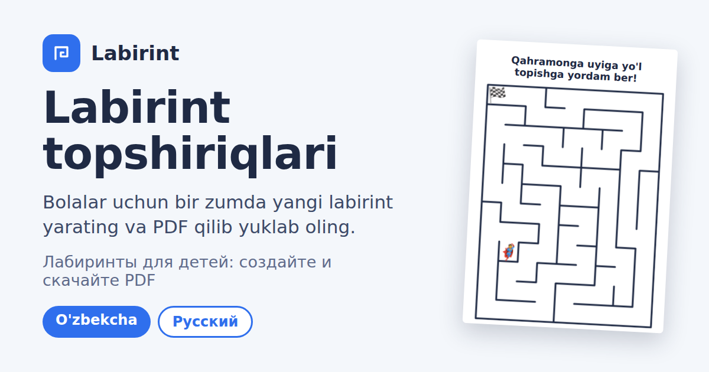

# Labirint topshiriqlari · Лабиринты для детей



**Sayt / Сайт:** https://umarxon7887.github.io/labirint/

[O'zbekcha](#ozbekcha) · [Русский](#русский)

---

## O'zbekcha

Bolalar uchun labirint topshirig'ini bir zumda yaratadigan bepul sayt. O'qituvchilar, ota-onalar va labirint topshirig'i kerak bo'lgan har qanday odam uchun. Ro'yxatdan o'tish va o'rnatish shart emas, telefondan ham, kompyuterdan ham ishlaydi.

### Imkoniyatlari

- Har safar yangi labirint. O'lcham 5×5 dan 100×100 gacha, tez tanlash uchun 4 ta qiyinlik darajasi bor.
- Labirint shakli: to'rtburchak, doira, yulduz, yurak, uchburchak, romb, uy, oltiburchak.
- Labirint raqami: bir xil raqam, o'lcham va shakl har doim bir xil labirintni beradi, shuning uchun topshiriqni keyin qayta chiqarib olish mumkin.
- Kirishda qahramon, chiqishda manzil stikeri labirintning tashqarisida turadi (har biri uchun 12 tadan tanlov).
- Varaq tepasiga o'zingiz xohlagan matn, matn o'lchamini sozlash ham mumkin.
- A4 varaqni PDF qilib yuklab olish (bosma uchun 300 dpi).
- Javob varag'i: to'g'ri yo'l qizil chiziq bilan ko'rsatilgan alohida PDF.
- O'zbek va rus tillari.
- Telefonga ilova kabi o'rnatiladi va internetsiz ishlaydi.

### Qanday ishlatiladi

1. Saytni oching: https://umarxon7887.github.io/labirint/
2. Topshiriq matnini yozing, o'lchamni tanlang.
3. Qahramon va manzil stikerini tanlang.
4. **Yangi labirint** tugmasi bilan yangisini yarating (yoki o'zingiz raqam kiriting).
5. **Topshiriqni yuklab olish (PDF)** ni bosing, chop eting yoki bolalarga yuboring.
6. O'zingiz uchun **Javob varag'ini yuklab olish (PDF)** ni saqlab qo'ying.

Fayl nomlari: `12345 raqamli labirint.pdf` va `12345 raqamli labirint javobi.pdf`.

### Telefonga o'rnatish

Chrome'da saytni oching, menyudan **Bosh ekranga qo'shish** ni tanlang. Ilova o'z ikonkasi bilan ochiladi va internetsiz ham ishlaydi.

### Maxfiylik

Hamma narsa brauzerning o'zida ishlaydi. Serverga hech narsa yuborilmaydi va akkaunt kerak emas. Faqat tanlangan til va stikerlar shu qurilmada eslab qolinadi.

### Qanday ishlaydi

- **Labirint:** Recursive Backtracker (DFS) algoritmi. Har doim bitta to'g'ri yo'l bor, aylanib qoladigan joy yo'q.
- **Kirish va chiqish:** shaklning bir-biridan eng uzoq ikki chekka joyida devor ochiladi, BFS bilan to'g'ri yo'l topiladi.
- **Shakllar:** shakl ko'pburchak sifatida beriladi, setkadagi qaysi kataklar shakl ichiga tushishi tekshiriladi va labirint faqat shu kataklarda quriladi.
- **Raqam (seed):** tasodifiy son generatori (mulberry32) shu raqamdan boshlanadi, shuning uchun natija takrorlanadi.
- **PDF:** varaq canvas'da chiziladi va bitta A4 sahifali PDF ga o'raladi. Kutubxona kerak emas.

### Fayllar

| Fayl | Vazifasi |
|---|---|
| `index.html` | Butun ilova (sahifa, algoritm, PDF) |
| `manifest.json`, `sw.js` | Telefonga o'rnatish va oflayn ishlash |
| `icon-*.png`, `apple-touch-icon.png` | Ilova ikonkalari |
| `og.png` | Havola ulashilganda chiqadigan rasm |

### Kompyuter yoki Termux'da ishga tushirish

`index.html` ni to'g'ridan-to'g'ri brauzerda ochsangiz ham ishlaydi. Oflayn rejim uchun kichik server kerak:

```bash
python3 -m http.server 8080
# yoki Node.js bilan:
node -e "require('http').createServer((q,s)=>{s.setHeader('Content-Type','text/html;charset=utf-8');s.end(require('fs').readFileSync('index.html'))}).listen(8080)"
```

So'ng brauzerda `http://localhost:8080` ni oching.

### Stikerlarni o'zgartirish

`index.html` ichida `HEROES` va `GOALS` ro'yxatlarini toping va emoji'larni xohlagancha almashtiring. Har birida 12 tadan bo'lsa, sahifa chiroyli chiqadi.

### Saytni yangilash

Fayllarni o'zgartiring, so'ng:

```bash
git add -A
git commit -m "Yangilanish"
git push
```

GitHub Pages bir-ikki daqiqada saytni yangilaydi.

---

## Русский

Бесплатный сайт, который мгновенно создаёт лабиринт-задание для детей. Подходит учителям, родителям и всем, кому нужны задания-лабиринты. Не нужно регистрироваться и устанавливать программы, работает и на телефоне, и на компьютере.

### Возможности

- Каждый раз новый лабиринт. Размер от 5×5 до 100×100, есть 4 уровня сложности для быстрого выбора.
- Форма лабиринта: прямоугольник, круг, звезда, сердце, треугольник, ромб, домик, шестиугольник.
- Номер лабиринта: один и тот же номер, размер и форма всегда дают один и тот же лабиринт, поэтому задание можно позже воспроизвести.
- Стикер героя у входа и стикер цели у выхода стоят снаружи лабиринта (по 12 вариантов для каждого).
- Любой текст сверху листа, размер текста можно менять.
- Скачивание листа A4 в PDF (300 dpi для печати).
- Лист с ответом: отдельный PDF, где правильный путь отмечен красной линией.
- Узбекский и русский языки.
- Устанавливается на телефон как приложение и работает без интернета.

### Как пользоваться

1. Откройте сайт: https://umarxon7887.github.io/labirint/
2. Напишите текст задания и выберите размер.
3. Выберите стикеры героя и цели.
4. Кнопка **Новый лабиринт** создаёт новый (или введите свой номер).
5. Нажмите **Скачать задание (PDF)**, распечатайте или отправьте детям.
6. Сохраните для себя **Скачать лист с ответом (PDF)**.

Названия файлов: `Лабиринт № 12345.pdf` и `Лабиринт № 12345 - ответ.pdf`.

### Установка на телефон

Откройте сайт в Chrome и выберите в меню **Добавить на главный экран**. Приложение откроется со своей иконкой и будет работать без интернета.

### Конфиденциальность

Всё работает прямо в браузере. Ничего не отправляется на сервер, аккаунт не нужен. На устройстве запоминаются только выбранный язык и стикеры.

### Как это работает

- **Лабиринт:** алгоритм Recursive Backtracker (DFS). Всегда есть ровно один правильный путь, без замкнутых кругов.
- **Вход и выход:** открываются в двух самых удалённых краях формы, правильный путь находится через BFS.
- **Формы:** форма задаётся многоугольником, проверяется, какие клетки сетки попадают внутрь, и лабиринт строится только на них.
- **Номер (seed):** генератор случайных чисел (mulberry32) стартует с этого номера, поэтому результат повторяется.
- **PDF:** лист рисуется на canvas и упаковывается в одностраничный PDF формата A4. Библиотеки не нужны.

### Файлы

| Файл | Назначение |
|---|---|
| `index.html` | Всё приложение (страница, алгоритм, PDF) |
| `manifest.json`, `sw.js` | Установка на телефон и работа офлайн |
| `icon-*.png`, `apple-touch-icon.png` | Иконки приложения |
| `og.png` | Картинка при отправке ссылки |

### Запуск на компьютере или в Termux

`index.html` можно просто открыть в браузере. Для офлайн-режима нужен небольшой сервер:

```bash
python3 -m http.server 8080
# или с Node.js:
node -e "require('http').createServer((q,s)=>{s.setHeader('Content-Type','text/html;charset=utf-8');s.end(require('fs').readFileSync('index.html'))}).listen(8080)"
```

Затем откройте в браузере `http://localhost:8080`.

### Смена стикеров

В `index.html` найдите списки `HEROES` и `GOALS` и замените эмодзи на любые. Лучше оставить по 12 в каждом, тогда страница выглядит аккуратно.

### Обновление сайта

Измените файлы и выполните:

```bash
git add -A
git commit -m "Обновление"
git push
```

GitHub Pages обновит сайт через пару минут.
